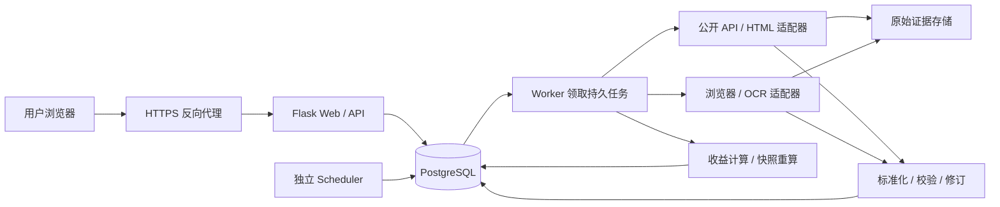

# 目标架构与采集流程

## 部署单元与职责



Web、scheduler、worker 来自同一代码版本，以不同入口运行。第一版使用 PostgreSQL 同时存储业务表和任务队列；采集期间不占用数据库写事务。原始证据初期放持久目录、数据库存引用及 hash，规模扩大后迁移对象存储。OCR/浏览器按需使用单独镜像和受限并发，避免影响普通 API 采集。

保留 Flask 的理由是可以渐进拆分现有应用。采用应用工厂和 Blueprint，模块导入时不建表、不启动任务；Gunicorn 仅加载 Web。该模式与 [Flask 应用工厂](https://flask.palletsprojects.com/en/stable/patterns/appfactories/)及 [Gunicorn 部署文档](https://flask.palletsprojects.com/en/stable/deploying/gunicorn/)一致。

## 建议目录（待实现）

```text
src/ledger/
  __init__.py                # create_app
  config.py
  auth/                     # 用户、会话、权限
  catalog/                  # 银行、发行机构、产品、销售渠道映射
  portfolio/                # 私有账户、交易流水、持仓投影
  market_data/              # 行情标准化、校验、选择、修订
  collectors/
    base.py                 # 统一协议和标准化输出
    registry.py             # 数据源配置到适配器的映射
    bocwm.py
    html.py
    browser.py
    ocr.py
  valuation/                # 持仓重放、收益、周期汇总
  jobs/                     # scheduler、worker、租约和重试
  db/                       # ORM models、事务、repositories
  api/                      # /api/v1 路由与 DTO
  templates/
  static/
migrations/                 # SQLAlchemy + Alembic schema 版本
tests/{unit,integration,contracts,e2e}/
tests/fixtures/             # 脱敏的 API/HTML/OCR 样本
scripts/                    # 数据迁移、备份、恢复、校验
deploy/                     # Dockerfile、Compose、环境模板
repo.wiki/
```

依赖方向：路由/任务 → 业务服务 → repository/适配器。采集器输出标准记录，不直接修改用户持仓；收益模块不访问银行网站；前端只格式化服务端结果。暂时无须为此引入独立前端框架。

## 采集器协议

每个数据源明确支持产品检索、产品详情、历史净值、累计净值、万份收益等哪些能力；不支持的字段返回明确状态，不伪造空值为成功。

建议协议：`fetch_product(source_product_id)`、`fetch_observations(source_product_id, start_date, end_date, cursor)`。返回分页游标、记录、原始证据引用与错误分类。网络获取、解析、字段校验分开，以便离线回放样本。

标准记录至少包含：

```text
product_id, source_id, source_product_id, metric_type,
valuation_date, published_at?, fetched_at, value_decimal, currency,
raw_artifact_id, parser_version, confidence?, quality_status
```

`valuation_date` 是净值归属日，不能直接用抓取日期代替。现代码使用 `releaseDate` 作为净值日期，接入验收时需验证该字段业务含义。银行销售代码先通过映射定位统一产品，不能直接当成全局产品 ID。

## API 和页面识别路线

1. 有公开且适用的结构化接口时优先使用接口，覆盖分页、日期范围、超时和空响应。
2. 静态网页用 requests + HTML 表格/语义选择器解析。动态网页用 Playwright 获取渲染后的 DOM；定位器使用稳定标签/文本和字段校验，避免仅靠位置或固定 sleep。参见 [Playwright locators](https://playwright.dev/python/docs/locators)。
3. 只有图片、扫描表格或无法提取文本时才使用 OCR；输出候选字段、置信度、截图区域和原图引用。产品代码、日期、数值都通过规则校验，低置信度、跨来源冲突及异常跳变进入人工复核。
4. 用户上传的账单/截图属于私有证据，必须绑定 user_id；不能未经审核转换成公共行情。

公开产品采集和私有银行账户连接器分开。第一版不承诺自动登录银行或处理验证码；登录态失效返回 `needs_action`，避免后台无限重试。数据源 URL 由受控配置定义，下载限制类型和体积，避免用户输入任意地址进入后台请求。

## 从调度到收益更新

1. scheduler 按数据源时区、公布规律、关注产品生成任务；只采集活跃持仓/关注产品，避免对每个用户重复采集。
2. 建议初始每日 22:05 主采集，次日上午补偿；这是产品默认配置，不保证各银行此时已发布。每来源独立配置公布日历与延迟阈值。
3. 任务落入 `jobs`；手工触发也进入同一队列。Web 立即返回 `202 + job_id`。
4. worker 在短事务中使用行锁领取任务，设置租约和递增的领取版本，然后提交事务再执行网络操作。
5. 保存原始证据、解析和校验；同一记录重试不重复写入。合格候选更新当前有效行情，有争议的留待复核。
6. 行情修订与受影响用户的重算任务在同一数据库事务提交，防止行情已更新但重算丢失。
7. 按用户、账户、产品和日期重放交易，生成新快照；相关日/周/月报表刷新，前端展示更新时间和完整性。

## 任务可靠性

- 调度任务唯一键建议为 `(job_type, source_id, product_id, scheduled_slot, range, generation)`；普通重复点击复用活跃任务，显式补数使用新的 generation。
- 状态：queued → running → succeeded / partial / retry_wait / needs_review / needs_action / failed。每次尝试单独记录，不用一段截断文本承载所有结果。
- 超时、429、5xx 做有上限的指数退避和抖动；格式变化、身份失效、字段冲突进入对应处理状态。初始最多三次重试，支持人工重新发起。
- 每来源限制并发和请求频率；单个银行故障不能阻塞其他银行。错误连续超过配置阈值可暂停该来源并告警。
- worker 心跳续租，宕机租约到期可重领；完成提交必须匹配当前租约版本，旧 worker 不得覆盖新 worker 结果。
- 接受“至少一次执行”，通过唯一约束和短事务保证业务效果幂等，不宣称分布式 exactly-once。
- 停机期间的周期由持久调度水位补发；净值每次回看最近一段历史以发现更正，长缺口用单独补数任务处理。

数据库队列采用 [PostgreSQL SELECT 锁语义](https://www.postgresql.org/docs/current/sql-select.html)中的 `FOR UPDATE SKIP LOCKED` 作为实现依据；具体支持版本在落地时锁定并测试。当任务积压持续超过数据时效目标时，再评估引入专用消息队列。

## API 边界（建议）

| 路径 | 用途与权限 |
| --- | --- |
| `/api/v1/products`、`/products/{id}/observations` | 公共目录和分页行情；普通用户只读 |
| `/api/v1/accounts`、`/positions`、`/transactions` | 当前用户账户、持仓、流水 |
| `/api/v1/imports`、`/imports/{id}/confirm` | 私有导入预览、映射、去重后确认 |
| `/api/v1/portfolio/snapshots?from=&to=` | 本人日快照 |
| `/api/v1/portfolio/returns?period=month` | 本人周期收益及完整性 |
| `/api/v1/sync-jobs`、`/sync-jobs/{id}` | 发起允许范围内的任务，查看脱敏状态 |
| `/api/v1/admin/sources`、`/reviews` | 管理员配置来源、审核公共净值 |

列表分页；日期范围设上限；金额和净值用十进制字符串传输；客户端不得指定其他 user_id。共享采集任务的技术日志只对管理员开放，用户只看到本人发起请求和相关产品状态。
